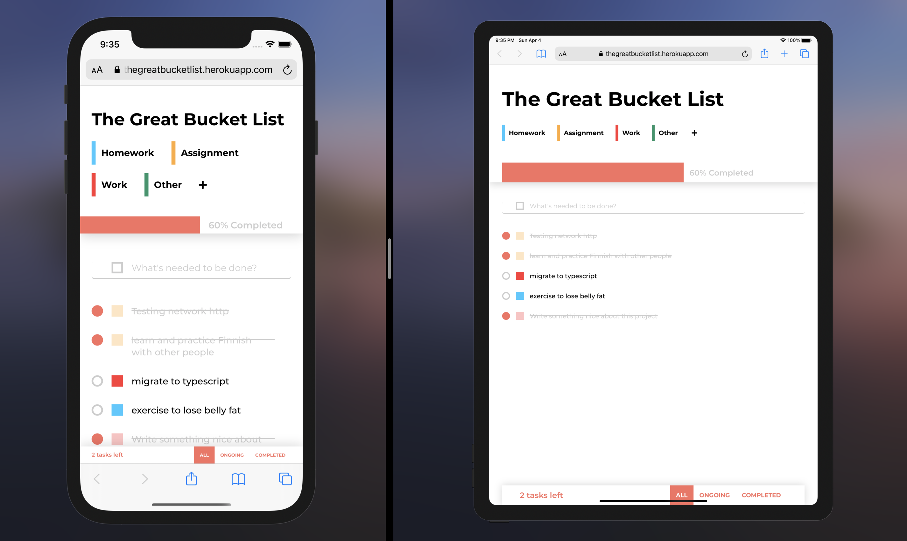

# The Great Bucket List

## Project overview

A friendly and fun-to-use application which can be used for versatile purposes from scribbling notes on the go or jotting down next challenges to overcome on your journey. With clean UI and exquisite UX, organizing tasks and checking them out when finished will be like a freeze. 

The app is designed by my talented friend [Minh Anh](https://www.linkedin.com/in/minh-anh3010/) 🔥 

Give it a try here: https://thegreatbucketlist.herokuapp.com/

<br/>


<br/>

## Technology stacks

#### Frontend
- Typescript
- React (Hooks & Context)
- Webpack
- SASS
- Jest & React Testing Library

#### Backend
- Typescript
- NodeJS & ExpressJS
- GraphQL
- Apollo
- MongoDB

## Running the app

To start the app in local environment:

- Run the server:

```bash
cd server && npm run start && cd ..
```

GraphQL endpoint is served at http://localhost:5000/graphql

- Run the client:

```bash
cd client && npm run start
```

Then go to http://localhost:3000 and see the app.

- To create production build (client)

```bash
cd client && npm run build
```

- To run all tests (client)

```bash
cd client && npm run test
```


## Project structure

### Client-side

```bash
├── config/webpack
├── dist
├── src
│   ├── components
│   ├── layouts
│   ├── modules
│   │   ├── category
│   │   |   ├── contexts
│   │   |   ├── hooks
│   │   ├── modal
│   │   |   ├── contexts
│   │   |   ├── hooks
│   │   ├── todo
│   │   |   ├── contexts
│   │   |   ├── hooks
│   ├── hooks
│   ├── styles
│   ├── types
│   └── views
├── README.md
├── package.json
└── .gitignore
```
##### config/webpack
Contains all webpack config for development and production.

##### components
Contains all commonly shared UI components. All of them are functional components, and most of them are free of logic to ensure the reusalibility principle.

##### layouts
Contains wrapper component acts as a layout for our main views.

##### modules
Contains domain logic which drives the application. Each domain represents a different concern of the app, namely: Category, Todo, and Modal. All business logic hooks and context are stored inside each domain.

##### hooks
Contains reusable utility hooks, that usually dont have anything to do with business logic. For example, `useFetch` is a handy utility to make any fetch call.

##### styles
Contains a set of design style guide through the use of preprocessor variables. This will avoid errors caused by "find-and-replace" all the things in the app once the UI is changed.

##### types
Contains Typescript types.

##### views
Contains our application main's views. For a SPA, it would be the entry point for each route.

##### dist
Contains distributed build generated by webpack.


## Responsiveness and cross-browser compatibility

This app is responsive for desktop, tablet, and mobile. It supports Chrome, Safari, Firefox, and Microsoft Edge.

<br/>




## Documentation

You can find all the documentation regarding the project here:

- [State managment](docs/state-management.md)

- [Best practices](docs/best-practices.md)

- [Development process](docs/dev-process.md)
