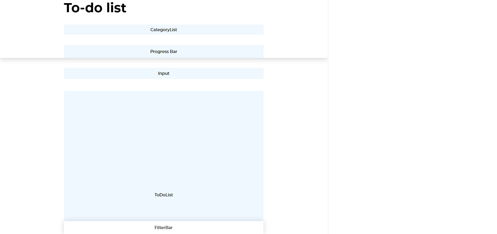

# 1. Overview

##### What is this project for?
StepOut develops this Todo App as an add-on gift for their users when they download the main Step Out application. It can be used for versatile purposes from scribbling notes on the go or jotting down next challenges to overcome on their fitness journey. With clean UI and friendly but exquisite UX, organizing tasks and checking them out when finished will be like a freeze.  

##### Overview of functionalities and user flows
This Todo App is designed with friendly UI/UX in mind, so functionalities such as adding or deleting a to-do item and mark it as completed remain similar to other on-the-market applications, yet users are surprised with the ability to add a category to each of their tasks and distinguish them by color. Moreover, they can filter the to-do list and have a good overview of their progress.

Give it a try here: https://thegreatbucketlist.herokuapp.com/

<br/>


<br/>

# 2. Technology stacks 

### React (with Hooks & Context)
This project is set up by [create-react-app](https://github.com/facebook/create-react-app). Undeniably, it is an instant way to get bootstrap a classic React app because of its complete build setup with Webpack, already-made project structure, script for running the application and bundle for production. 

It's a good choice for small, hobby project, yet might become inconvenient once our project grows and scales (since it is bloated with unnecessary files, and it is also difficult to use libraries that `create-react-app` doesn't support).
In that case we should setup our project from scratch to easily customize and configure it the way we want.

### Jest & Enzyme (testing)
Jest is a JavaScript unit testing framework used to test service and React applications. Enzyme provides a way to interact with UI elements during testing. We already have Jest out of the box when setting up project with create-react-app. So we don't need to install it separatedly. Therefore, the combination of them proves beneficial to test React app with Jest as a test runner and assertion library and Enzyme to build tests for UI. 

### SASS
People nowadays are working more and more with modern styling approaches such as CSS modules, Styled components, etc. Having worked with them before in my project, I've found it very useful and beneficial especially with a large project where multiple teams work together as it maintains common style guide and avoid the hassle of replacing bits of styling once the design changes. 

However, for a small project with limited time budget, they are a bit overkill. That's why SASS is more convenient and easy to use. By leveraging CSS variables and conceptually scoping styling for each component, we still aim for maintainable styling approach, at the same time keep it simple.

Note: `create-react-app` hasn't supported an out of the box way to share SASS variables across different SASS modules, without expliciting importing them in relative paths. Therefore, CSS variables come as a rescue and handy way to maintain theme variables.

# 3. Running the app

To start the app in local environment:
```bash
npm run start
```

To create production build:

```bash
npm run build
```

To run all tests:

```bash
npm run test
```

# 4. Project structure

```bash
├── src
│   ├── assets
│   ├── components
│   ├── layouts
│   ├── modules
│   │   ├── category
│   │   |   ├── contexts
│   │   |   ├── hooks
│   │   ├── modal
│   │   |   ├── contexts
│   │   |   ├── hooks
│   │   ├── todo
│   │   |   ├── contexts
│   │   |   ├── hooks
│   ├── hooks
│   ├── styles
│   └── views
├── README.md
├── package.json
└── .gitignore
```
##### assets
Contains static assets (eg. logo and icons) that are used through out the application. 

##### components
Contains all commonly shared UI components. All of them are functional components, and most of them are free of logic to ensure the reusalibility principle.

##### layouts
Contains wrapper component acts as a layout for our main views.

##### modules
Contains domain logic which drives the application. Each domain represents a different concern of the app, namely: Category, Todo, and Modal. All business logic hooks and context are stored inside each domain.

##### hooks
Contains reusable utility hooks, that usually dont have anything to do with business logic. For example, `useFetch` is a handy utility to make any fetch call.

##### styles
Contains a set of design style guide through the use of preprocessor variables. This will avoid errors caused by "find-and-replace" all the things in the app once the UI is changed. 

##### views
Contains our application main's views. For a SPA, it would be the entry point for each route.

# 5. State management

State management is one of the most critical, yet complicated part of every React application. Large projects usually rely on State Management libraries such as Redux (industry standard) for a scalable and maintainable solution.

However, for small projects (like this one), React built-in `Context API` and `Hooks` are a nice and convenient way, yet still powerful enough to reduce the hassle of state management, as well as keeping the integrity of our application. Plus, we don't need to install other dependencies (which might add extra kb to our bundle size) !

In this project, `Contexts` and `Hooks` are separated according to the application's domain, for example:

```bash
├── category
│   |   ├── contexts
│   |   ├── hooks
```


- `Context` provides a complete global state management solution. It serves act as a "data center" for our application's states, and is responsible for streamlining data accross our component's tree. Any components can subscribe to Contexts to get necessary data:

```js
// in CategoryList.js

import { useCategory } from "../../modules/category/contexts/CategoryContext";

const CategoryList = ({ className, onCategoryClick }) => {
  const { categories } = useCategory();

  return (
    <div className={className}>
      <div className="td-category-list">
        {categories.map((el, id) => (
          <Category
            key={id}
            category={el}
            onClick={(category) => onCategoryClick(category)}
          />
        ))}
        ....
        </div>
      </div>
    </div>
  );
};

```

- `Hooks`, on the other hand, supply state management's logic, with the help of `Reducer` pattern. 

Each hook will have its own `reducer` function, which will compute the new states based on the `action` type and payload. It is useful for computing multiple states at once (which is usually a hassle with normal `useState`).

```js
// todoReducer.js
// where we need to compute multiple state at once

....
const todoReducer = (currentState, { type, payload }) => {
  ....
  
  case "ADD_TODO":
      const { todo: addedTodo } = payload;

      updatedTodos = [...state.todos, addedTodo];
      uncompletedCount = updatedTodos.filter((todo) => !todo.completed).length;
      completedCount = updatedTodos.length - uncompletedCount;

      return {
        ...state,
        todos: updatedTodos,
        filteredTodos: updatedTodos,
        uncompletedCount: uncompletedCount,
        completedPercent: calculateCompletedPercent(
          completedCount,
          updatedTodos.length
        ),
      };
      
  ....
}

```

With the help of React built-in `useReducer`, we can always get the updated state, as well as a `dispatch` function to dispatch our actions to the reducer:

```js
....
// in TodoHooks

const [state, dispatch] = useReducer(todoReducer, initialState);

...

// dispatching action

const addTodo = (todo) => {
  postTodo(todo, (resData) => {
    if (resData) {
      dispatch({ type: "ADD_TODO", payload: { todo: resData } });
    }
  });
};

```

# 6. Patterns and Practices
This project respects React's design principles and aims for scalability and reusability by leveraging industry-standard best practices and design patterns:

### Immutability
It goes without saying that one cannot ignore Immutability principle when working with React's state. Immutable states will help React to recognize that there are changes in our component and will re-render it, as well as prevent unnecessary side-effects.

Therefore, in our `reducer` function, we will always return a computed new state, without mutating the original state, for example:

```js
// Add new todo without mutating array/object (by using ES6 spread operator)

updatedTodos = [...state.todos, addedTodo];

return {...state, todos: updatedTodos}

```


```js
// Or leveraging ES6 higher-order functions such as `map`, `filter`, `reducer`, etc.

// Remove todo from array
updatedTodos = state.todos.filter((todo) => todo.id !== deletedId

```

### Reusable components and logics
Reusability has always been a main concern for any application development. It will save development time and make it easier to scale and maintain our application.

Adhering to DRY (Don't repeat yourself) principle, several design patterns have been taken into usage to promote reusability, such as: 

#### Compound component

Component component is a versatile pattern to help us design our components to be extendable and customisable, and can be used universally. Its core purpose is to let the component's user to define what content (specifically the markup) they would like to render, as well as the order of it. 

For example, in our `Modal` component, we receive a `children` props, which is rendered as our Modal's actual content:

```js
...

const Modal = ({ className, children, modalKey, visible }) => {
  ...
  return (
    <div className={`td-modal-wrapper ${visible ? "show" : "hide"}`}>
      <div className={`td-modal ${className}`}>{children}</div>
      <Backdrop closeModalHandler={closeModalHandler} modalVisible={visible} />
    </div>
  );
};
```

Then we can reuse our `Modal` component in different contexts:

```js
// in ConfirmModal component, which is an extension of the Modal component
...
const ConfirmModal = (props) => {
  ...
  return (
      <Modal className={className} visible={isVisible} modalKey={key}>
        <div className="td-confirm-modal">
          <Button onClick={okHandler} type="danger">
            {okText}
          </Button>
          <Button
            onClick={onModalClose}
            className="confirm-modal-cancel-btn"
            type="text"
          >
            {cancelText}
          </Button>
        </div>
      </Modal>
    );
}
```

#### Reusable logic with hooks

Hooks make it easier to write reusable logic and integrate it to our component.

For example, we have a reusable [useInput](https://github.com/leannedo/Assignment/blob/master/client/src/modules/input/hooks/useInput.js) hook, which take the input's initial value, as well as a set of validation rules, then return the input's prop, containing the current input's `value`, `valid` state, an input's `onChange` and `validate` method. We can then reuse this hook for multiple inputs in our form.

```js
// initialize color input's state with useInput

const [colorProp, setColor] = useInput({
    validationRules: { isRequired: true, isHexCode: true },
  });
  
// accessing input's current value
colorProp.value

// triggering input's onChange and validate method
colorProp.onChange(value)
colorProp.validate(value)
  
```

# 7. Documentation & Testing
The project leverages [PropTypes](https://reactjs.org/docs/typechecking-with-proptypes.html) and [JSDocs](https://jsdoc.app/) for type-checking and better documentation. JSDocs annotates source code and help other developers catch parameter and return types, as well as what is going on and the purpose of a method, component.

These are the mitigation approaches for lacking of a real compile-time validation, such as Typescript. State varies drastically, and sometime it's impossible to know the type of data we receive. Intergrating Typescript with set-out types will definitely detect unnecessary bugs and improve the quality of our code. Therefore, switching to Typescript will be one of the improvement point for the project.

The project also have several tests running to ensure everything is working smoothly through each iteration, and reduce the amounts of unexpected bugs as much as possible. 

Tests are written mostly for our application logic's part, such as `reducers` and `hooks`. With more time given, we can also have a snapshot testing for each of our components, but that can be improved later.

# 8. Responsiveness & Cross-browser compatibility
This app is responsive for desktop, tablet, and mobile. It supports Chrome, Safari, Firefox, and Microsoft Edge.
 
<br/>


<br/>
<br/>

----
The below sections are the extra chapters that I document my development process. Feel free to take a look if you are interested !

## Process

### 1. Setting up project
- Initialize project with `create-react-app`
- Setting up SASS / theme variables / component structure.

### 2. Wireframing
Construct wireframe with main components based on design. It becomes extremely useful once we've built other generic components and chain them together to place in those placeholders. And it fast forwards the building of the app's UI. 

<br/>



### 3. Building components
Building smaller parts of the component should always be the first thing to do, before composing them in our main view.

- Generic components which will be reused throughout the app: Todo, Category, Button, Icon, Modal, Input, Backdrop, etc


<br/>


- Other components: CategoryList, TodoList, FilterBar, etc.

### 4. Composing components
This is the fun part: composing all of the components in our main Dashboard view, and adjusting them so they can work perfectly together.

### 5. Connecting logic
The most strenuous part, including:
- State mananagement with contexts, hooks, reducer for each application domain.
- Event handler
- Validation
and etc.

### 6. Streamlining data
Usually, we are getting bored of manually writing mock data without actual Backend. That's why https://www.mockapi.io/ comes as a fun tool to use. It helps me to mock the API and therefore, make it easier to write asynchronous calls in our application (fetch/post/update/delete todo, etc). This way we can ensure that the Backend integration part will become as smooth as possible. 

### 7. Writing tests

This is when we try to break out application. By having actual test coverage, we can feel more confident about our application going live !

### 8. Deploying 
When everything is ready, it's a good time to see our application going live. I create a simple server to serve our static assets, and with several configs, the application can be easily deployed to Heroku.


----
### Improvements

- SVG Icon/Font icon

The icon used in this project is exported from the design and used as a `img` tag. This is not really optimised and make it difficult to change the icon's state (color, stroke width, etc). We might need to use a font icons, or write a helper to render our icon as HTML SVG tag.

- Type-checking (with Typescript)

Currently we use PropTypes and JSDocs to document type of props in each component, yet we can push it a bit further by using Typescript. 

- Browser compatibility

Font-weight on Firefox and Chrome on Mac is currently darker than in Chrome Windows and Safari. 

- ID generation with mockAPI does not work as expected

ID generated by mockAPI (https://www.mockapi.io/) is the same everytime we add new data, therefore, the application might not work as expected after 2 or more item is added. This can be solved by using a proper Backend API.
