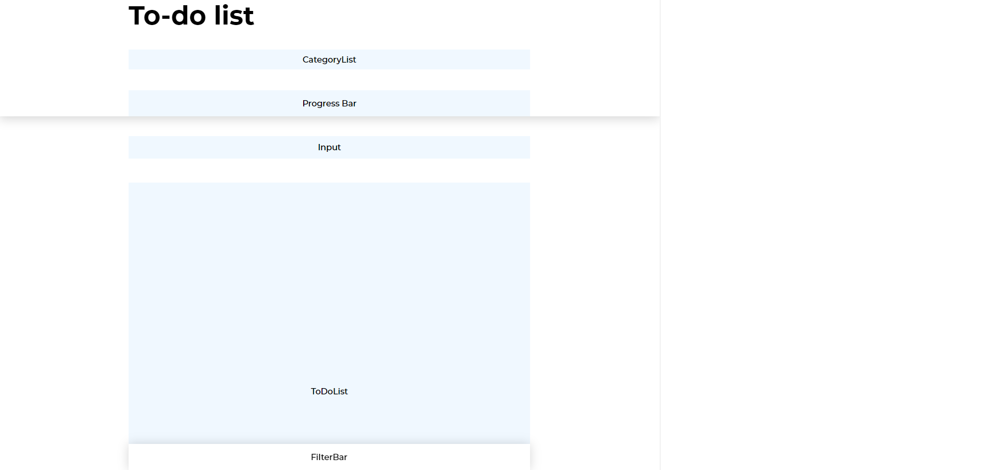
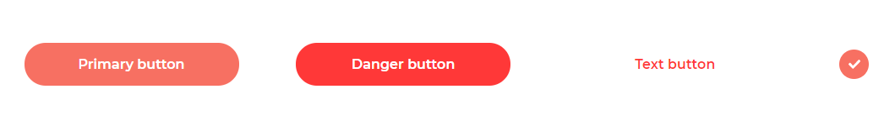

# Development process

## Client-side

---

### 1. Setting up project
- Scaffold project with webpack.
- Setup Typescript config and ESLint.
- Setting up SASS / theme variables / component structure.

### 2. Wireframing
Construct wireframe with main components based on design. It becomes extremely useful once we've built other generic components and chain them together to place in those placeholders. And it fast forwards the building of the app's UI.

 

### 3. Building components
Building smaller parts of the component should always be the first thing to do, before composing them in our main view.

- Generic components which will be reused throughout the app: Todo, Category, Button, Icon, Modal, Input, Backdrop, etc

 

- Other components: CategoryList, TodoList, FilterBar, etc.

### 4. Composing components
This is the fun part: composing all of the components in our main Dashboard view, and adjusting them so they can work perfectly together.

### 5. Connecting logic
The most strenuous part, including:
- State management with contexts, hooks, reducer for each application domain.
- Event handler
- Validation
  and etc.

### 6. Streamlining data
Setup Apollo Client and connect Backend.

### 7. Writing tests
This is when we try to break out application. By having actual test coverage, we can feel more confident about our application going live !

### 8. Deploying
When everything is ready, it's a good time to see our application going live. I create a simple server to serve our static assets, and with several configs, the application can be easily deployed to Heroku.

